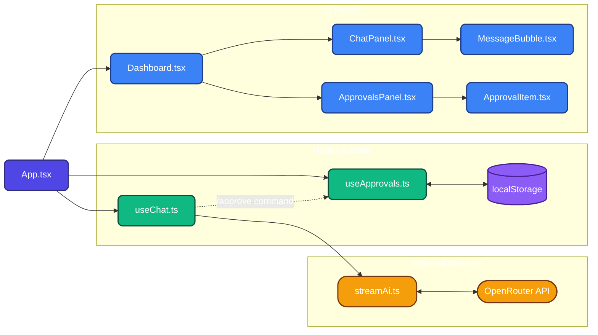

# AI Assistant Dashboard

**✨ Live Demo Base Link:** [https://ai-assistant-dashboard-chi.vercel.app](https://ai-assistant-dashboard-chi.vercel.app)

## Overview
A robust, highly performant single-page React application functioning as the frontend for an AI assistant. This application demonstrates real-world UI patterns, including decoupled streaming AI text generation, concurrent animation handling, accessibility compliance, and clean component-driven architecture. 

The application is split into two primary interfaces: an interactive Assistant Chat panel and a state-persistent Pending Approvals management panel.

## Features Implemented

### Core Functionality
* **Dual Panel Layout:** Fully responsive chat and approval panels optimized for varying screen sizes.
* **Streaming AI Architecture:** Implements a decoupled Producer/Consumer buffer system to process Server-Sent Events (SSE). This guarantees a smooth 60fps typewriter effect mapped seamlessly to the React DOM, completely immune to network chunking or latency spikes.
* **Concurrent Event Handling:** Engineers rapid-click safety for approving/rejecting items. Each DOM node maintains independent timer and transition states, allowing users to interact with multiple items simultaneously without data collision or layout shifts.

### Technical & UX Enhancements
* **Strict Type Safety:** Fully typed leveraging TypeScript interfaces with zero fallback to `any`.
* **Accessibility (a11y) Compliant:** Utilizes ARIA live regions (`aria-live="polite"`) for screen-reader announcements, proper DOM roles, and clear focus-visible outlines for keyboard navigability.
* **Data Persistence:** Rehydrates the Pending Approvals state gracefully using `localStorage` synchronization.
* **In-Chat Commands:** Built-in `/approve <action>` chat slash command to dynamically bridge actions from the Chat panel directly into the Approvals queue.

## Getting Started

### Local Installation
1. Install project dependencies:
   ```bash
   npm install
   ```
2. Start the Vite development server:
   ```bash
   npm run dev
   ```
3. Navigate to `http://localhost:5173` in your browser.

### Real AI API Integration (Optional)
By default, the application runs a local offline simulation for instantaneous testing. To interface with real live models:
1. Duplicate `.env.example` and rename it to `.env`.
2. Add a valid OpenRouter API key.
3. Restart the development server. The application will automatically detect the key and seamlessly route requests to OpenRouter's live LLM infrastructure, maintaining the same smooth visual streaming effect.

## Technical Architecture

### Component & Data Flow Diagram


* **Framework:** React + TypeScript scaffolded via Vite for optimized hot-module replacement and rapid bundling.
* **Styling:** CSS Modules with raw CSS variables. This choice explicitly bypasses utility classes (like Tailwind) to demonstrate strong fundamental CSS competency and scope isolation.
* **State Management:** Utilizes localized native React hooks (`useState`, `useRef`, `useEffect`). Global state containers (e.g., Redux) were intentionally avoided to prevent over-engineering a primarily two-panel data flow.

## How I Used AI

I used Claude (via Antigravity) as a supporting tool, but I drove the overall design and decisions. I first defined the architecture and feature approach myself, then used AI to help translate those ideas into a structured implementation plan.

Rather than accepting outputs directly, I guided the AI with specific requirements from the assignment and iteratively refined its suggestions. I used it to scaffold components, validate edge cases (such as streaming behavior and concurrent interactions), and troubleshoot targeted issues that arose during manual testing.

At each stage, I verified the behavior in the browser and adjusted the implementation where needed. As a final step, I cross-checked the completed solution against the assignment requirements using AI to ensure nothing was missed.

Overall, AI was used as a productivity and validation tool, while all key decisions, refinements, and final implementations were controlled and reviewed by me.


---

## Code Review Questions

### Q1 — Streaming cleanup
**What happens if the user closes the tab or navigates away while a response is still streaming? Walk us through the relevant part of your code.**

We handle this using an `AbortController` cleanly mounted inside a React `useEffect`. When the component hosting the chat unmounts (closes/navigates away), the cleanup function inherently fires `abort()`. This instantly kills the active network request and ceases the local `for await` generator loop, ensuring the app does not attempt to map text to an unmounted DOM node, which prevents React state memory leaks.
```tsx
  useEffect(() => {
    return () => {
      // Fires when component unmounts, killing the active stream
      abortControllerRef.current?.abort(); 
    };
  }, []);
```

### Q2 — Concurrent actions
**A user approves item A and immediately approves item B before A's exit animation finishes. What does your code do? Did you test this? Paste the ~5 lines most relevant to this scenario.**

Yes, I explicitly tested this. When manipulating rapid clicks, the code isolates each transition state by pushing IDs into an `exitingIds` Set. Rather than deleting the data instantly, the app triggers CSS slide-out animations concurrently per item, and manages individual `setTimeout` functions to remove from the data array later. Because each closure contains its own individual ID and timer, rapidly clicking multiple items animates and strips them safely without collision.
```tsx
const handleRemove = (id: string, actionUrl: string) => {
  setExitingIds((prev) => new Set(prev).add(id));
  
  setTimeout(() => {
    setApprovals((prev) => prev.filter((item) => item.id !== id));
    setExitingIds((prev) => {
      const next = new Set(prev);
      next.delete(id);
      return next;
    });
  }, 400); // Matches CSS transition exactly
};
```

### Q3 — Your worst trade-off
**What is the weakest part of your implementation — the thing you'd fix first if you had two more hours? Be specific: name the file and the function or component.**

The weakest architectural point is the prop-drilling implementation of state situated inside `src/App.tsx`. 
Currently, I instantiate `useChat()` and `useApprovals()` globally at the top level of `App.tsx` and pass their resulting variables down into `<Dashboard>` simply as props. If I had two more hours, I would rip out this prop-drilling and implement a localized state container (like React Context or Zustand) mapping directly to those data stores to prevent excessive re-rendering across the DOM layout wrapper.

### Q4 — One thing the AI got wrong
**Describe one specific thing your AI tool suggested or generated that you had to change.**
When generating the initial version of ApprovalsPanel.tsx, the AI did not follow the layout behavior I had intended. My plan was for the approvals panel to act as a scrollable container so that it could handle an arbitrary number of items without breaking the layout.

However, the AI’s implementation rendered the items in a static container without any overflow handling. During manual testing, I noticed that as more approval items were added, they extended beyond the visible panel and became inaccessible, which directly contradicted the intended UX.

I identified this mismatch and corrected it by explicitly adding a scrollable container (overflow-y-auto) to the panel. This aligned the implementation with the original design goal and ensured the panel remained usable regardless of the number of items.
